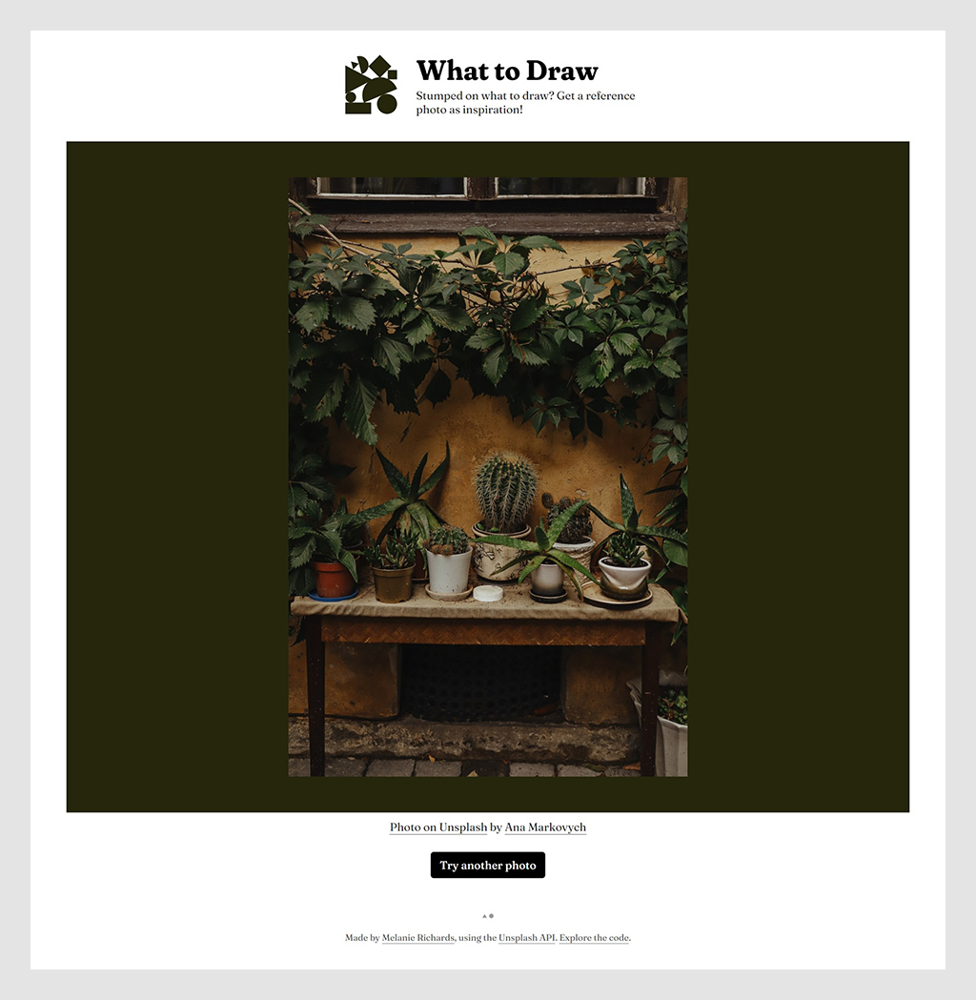

# What To Draw

[STAGING BRANCH]

Using the Unsplash API to come up with drawing prompts!

Live site at [whattodraw.melanie-richards.com](https://whattodraw.melanie-richards.com)

## Running locally

This project uses Netlify serverless functions, and the [Netlify CLI](https://docs.netlify.com/cli/get-started/) for local development. Prereqs: [Node.js](https://nodejs.org/en/download/) v10+, (free) account on [Netlify](https://netlify.com).

### Project setup

1. From the [Unsplash API documentation](https://unsplash.com/documentation), "register as a developer".
2. Create a [new application](https://unsplash.com/oauth/applications).
3. Once created, copy your "Access Key".
4. Create a file `.env` in the root directory of this project, and set the contents of the file to `UNSPLASH_API_KEY=YourAccessKeyGoesHere`.
5. Navigate to the project directory in your terminal, and run `npm install` to install dependencies.

### First run

1. Navigate to the project directory in your terminal / command line.
2. Run `npm install netlify-cli -g`.
3. Run `ntl login` to log into Netlify.
4. Run `ntl dev` to spin up the local development server.

### Other commands

| Command | Purpose |
| :------ | :------ |
| `ntl dev` | Run local dev server |
| `npm run watch:sass` | Watch and compile changes to Sass files |

## Additional details

[Photo of water in site icons](https://unsplash.com/photos/ZxGdri2EWzk) by 
Akira Hojo.